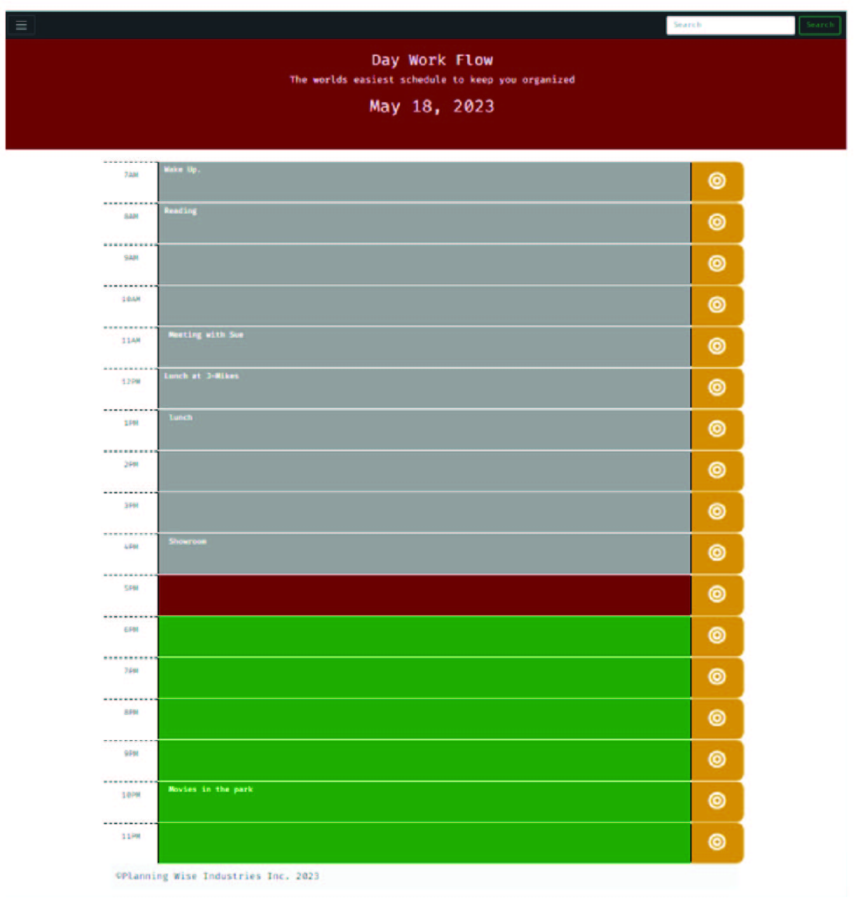

# Day Wrok Flow

## Project purpose
Presenting the worlds easiest Day Flow Scheduler.
It is intended to be track your corrent hour by colorcoding the 
past - gray, 
present - maroon, 
and future hours in green. 

At the top of the page you can see the todays date that will update automatically. 
further each  hour is broken into the separate entry for your activities which can
be saved by clicking the orange target button.

## Usage

Thhis simple hour tracker helps you to know whcih hour you are currently in and what task is assigned to this hour. 

## Results

You are able to input tasks for each hour separately and see what you need to do. 

## Design

Each hour is designed to see the time, task assignment, and save button for the task to keep it stored.

## Credits

Starter Code provided by:
- - -
© 2022 Trilogy Education Services, LLC, a 2U, Inc. brand. Confidential and Proprietary. All Rights Reserved.
